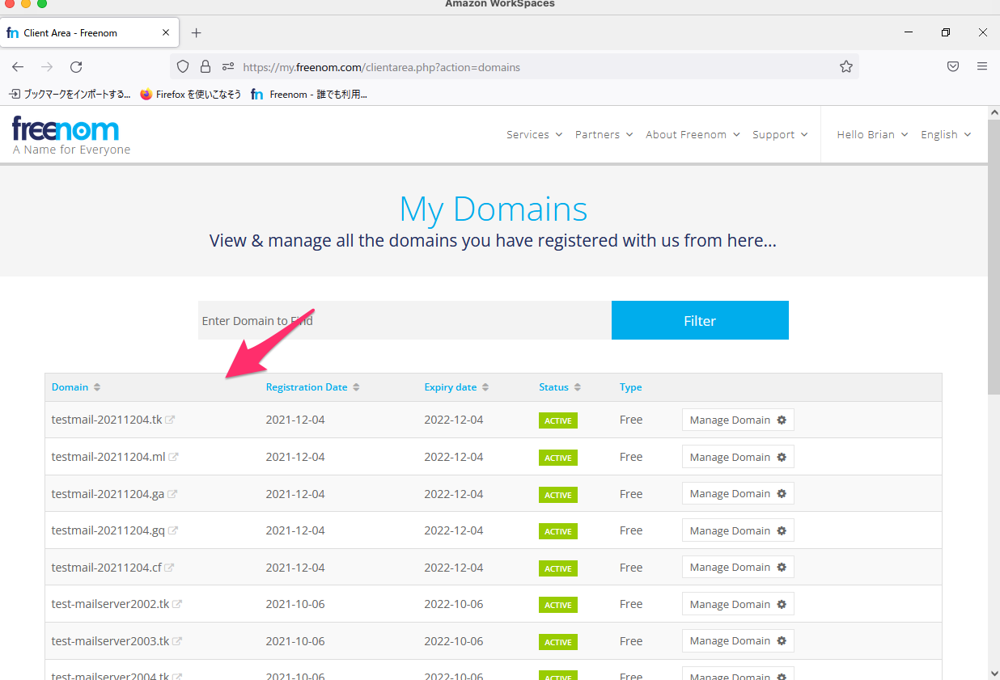
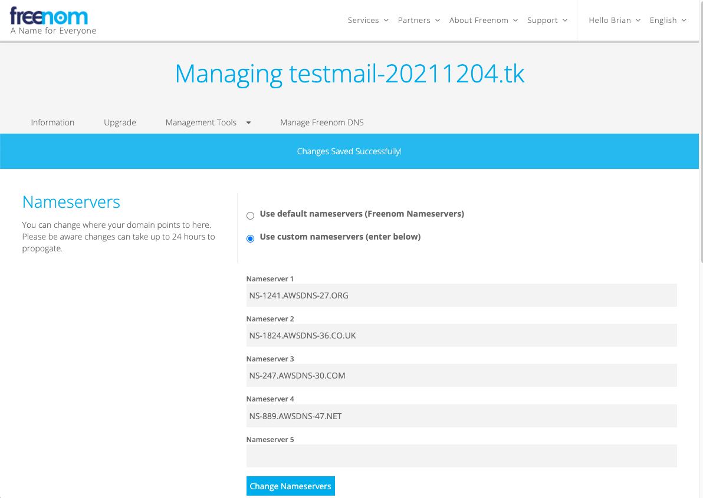
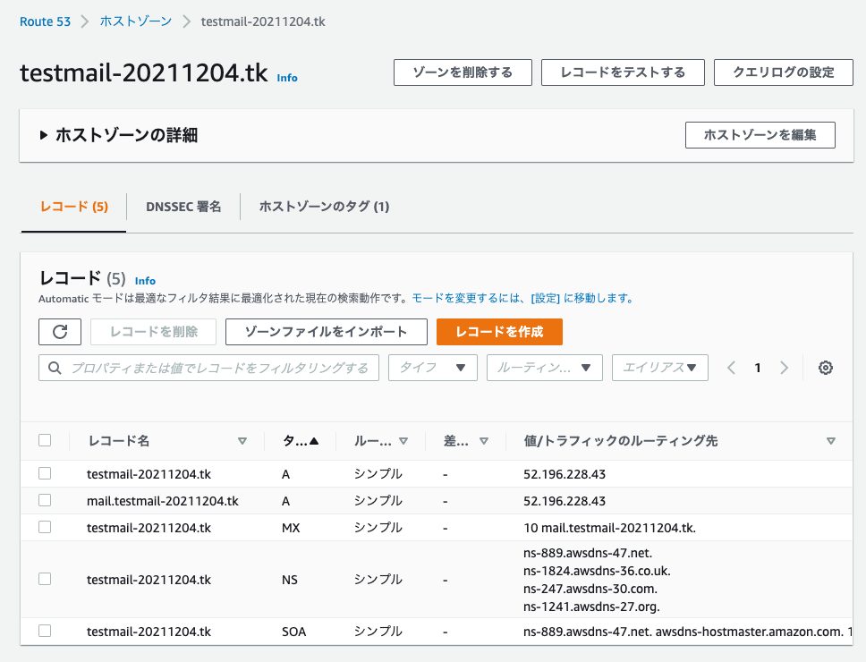

# メールサーバ構築

## ドメイン取得

### freedom

https://www.freenom.com/ja/index.html<br>
↓<br>
`test-mail-20211204.tk`を取得する<br>
↓<br>


### AWS Route53

ホストゾーンを作成し、ネームサーバの情報を確認

```
ns-0000.awsdns-00.net.
ns-0000.awsdns-00.co.uk.
ns-0000.awsdns-00.com.
ns-0000.awsdns-00.org.
```

※route53 のものを利用

### freenom の対応ドメインのネームサーバへ設定



### EC2 を起動

#### EIP

```
521.254.301.123
```

※実際は生成した固定 IP にする

#### SSH 接続

```
ssh -i ~/.ssh/mshige1979-ec2-ssh.pem ec2-user@521.254.301.123
```

↓

```

       __|  __|_  )
       _|  (     /   Amazon Linux 2 AMI
      ___|\___|___|

https://aws.amazon.com/amazon-linux-2/
```

## ホスト名

### ドメイン

```
testmail-20211204.tk
```

### ホスト名

```
mail.testmail-20211204.tk
```

## AWS Route53 設定



### EIP の逆引き


## EC2

### yum update

```
sudo yum update -y
```

## SPF 設定サンプル

https://mxtoolbox.com/spf.aspx

```
testmail-20211204.tk. IN TXT "v=spf1 ip4:521.254.301.123 -all"
```

### dig

```
dig -t TXT testmail-20211204.tk
```
